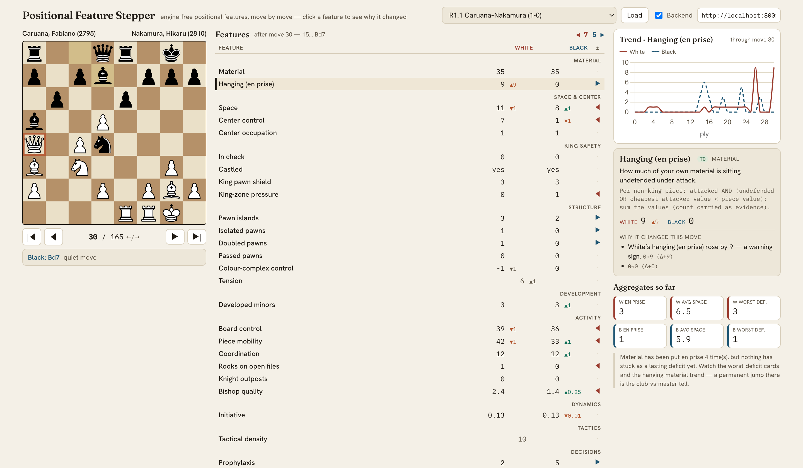

# Chess Style Lab

**Engine‑free chess feature analysis.** Most chess tools tell you *how well* you
played (accuracy, centipawn loss). Chess Style Lab measures *how* you play — the
positional and behavioural signatures of your moves — almost entirely from the board,
with no Stockfish in the core path.

Load any game, step through it move by move, and watch ~25 positional features update
for both sides. Click any feature to see, in plain English **and** exact terms, what
it measures and **why it just changed**, with the relevant squares lit up on the board.



---

## Why

Strength and style are largely orthogonal. Engines already quantify strength
exhaustively; almost nothing quantifies *style* — do you grab space or counter‑punch,
hold central tension or release it, seek complications or simplify, coordinate your
pieces or leave them loose? Those are board‑computable, and they're what separates one
player's games from another's at the same rating. This project builds a reproducible,
testable feature pipeline for exactly that, on free public data.

## Features

- **~25 positional features across skill tiers T0–T3**, all engine‑free: material &
  hanging pieces, king safety (check / castling / pawn shield / king‑zone pressure),
  space & centre, pawn structure (islands, isolated / doubled / passed, colour
  complex), activity (board control, per‑piece mobility, coordination, rooks on open
  files, knight outposts, good/bad bishop), tension, and a behavioural **MOVE tier**
  (initiative, tactical density, prophylaxis).
- **Move‑by‑move explanations.** Every feature shows its value, the change since the
  last move (Δ), and a generated "why it changed" note — toggle nothing, both the plain
  and technical readings are shown. Spatial features highlight their squares on the board.
- **At‑a‑glance balance.** A comparison column marks which side each feature favours,
  with a running tally so one look tells you who's better, structurally.
- **Two modes, one UI.** An instant **offline** mode computes the board‑tier features
  in the browser; a **backend** mode runs the full Python pipeline (richer features,
  persistence) over HTTP. Both render from the same JSON contract.
- **A real games library.** ~760 master games bundled and browsable through two
  cascading filters — **tournament · section** (FIDE Candidates 2026 Open/Women, FIDE
  Grand Swiss 2025, Norway Chess 2026) then **round · game** — plus custom PGN paste.
- **Parity as an invariant.** The Python engine is the source of truth; the JS engine
  must reproduce it exactly on golden positions — enforced by the test suite.

## Architecture

```
┌───────────────── Frontend (web/, static, no build step) ─────────────────┐
│  Quick mode:  parser.js + engine.js → board‑tier features, in‑browser      │
│  Backend mode: fetch the API → same per‑ply JSON, richer features          │
│  UI: board + highlights · registry‑driven feature table · explanation panel │
│       · trend chart (follows the selected feature) · aggregates             │
└───────────────────────────────┬───────────────────────────────────────────┘
                                 │ HTTP / JSON
┌────────────────────────────────▼──────────────────────────────────────────┐
│  Backend (engine/chesslab, FastAPI)                                          │
│   features.py    canonical, zero‑dependency feature engine (parity source)   │
│   registry.py    Feature framework — scopes (POSITION/MOVE/GAME/CORPUS) +     │
│                  capabilities (CLOCK/EVAL/REF); keeps eval out of the core    │
│   pipeline.py    PGN ingest (python‑chess); preserves %clk / %eval           │
│   orchestrator.py runs the registry → per‑ply explainability payload         │
│   manifest.py    generates features.yaml (single source of truth)            │
│   store/         FeatureStore — file artifacts now, DuckDB/Parquet later      │
│   api.py         GET /features · POST /games · GET /games/{id}/features       │
└─────────────────────────────────────────────────────────────────────────────┘
```

The **canonical math lives in Python and is never duplicated by hand**: the JS engine
is a tested mirror of the board tier; the MOVE/GAME tier is backend‑only. Engine
evaluation (cached Lichess cloud‑eval) is a strictly optional, isolated tier — it never
touches the core path.

## Quick start

```bash
# 1) Interactive app (static — no build step)
python3 -m http.server -d web 8000          # → http://localhost:8000

# 2) Optional: the analysis backend (the app uses it by default)
cd engine
python3 -m venv .venv && .venv/bin/pip install -e ".[dev,pipeline]"
.venv/bin/python -m uvicorn chesslab.api:app --port 8001
```

Open **http://localhost:8000**. Pick a tournament, then a round/game (or paste your own
PGN), step with **← / →**, and click any feature to see why it moved. Deep‑link a
position with `#<game-id>@<ply>`, e.g.
`http://localhost:8000/#candidates-2026-open__r01b01@30`.

> The **Backend** checkbox is on by default; if the backend isn't running the app
> falls back to offline mode automatically.

## Tests

One command runs the whole suite — Python golden/unit tests, the generated
`features.yaml` sync check, and the JS module / parser / analysis / library / parity
checks:

```bash
./run_tests.sh
```

Testing is meant to be automatic: a `PostToolUse` hook runs the suite on every code
edit, and `.github/workflows/tests.yml` runs the same on push. The hard invariants:
the §6 golden values, JS↔Python parity over the golden FENs, and `features.yaml` in
sync with the registry. Mobility is additionally cross‑checked against a python‑chess
oracle.

## Project layout

```
web/                  interactive stepper (static)
  index.html          markup + styling
  src/engine.js       board‑tier feature engine (JS mirror of Python)
  src/parser.js       PGN tokenizer + chess.js move application
  src/catalog.js      board‑tier feature metadata + display order
  src/analysis.js     builds the per‑ply explainability payload (offline)
  src/highlights.js   "why" board‑square highlights
  src/explain.js      feature table + explanation panel
  src/api.js          backend client (analysis mode)
  src/app.js          UI controller
  src/pieces.js       inlined lichess "cburnett" SVG pieces
  data/library.json   tournament index (first filter)
  data/t/<slug>.json  per-tournament games, lazy-loaded (second filter)
  test/               module / parser / analysis / library / parity tests
engine/chesslab/      canonical engine + analysis backend (see Architecture)
data/raw/             original tournament PGNs (source)
data/tournaments/     extracted, per-round PGNs (one folder per tournament)
scripts/build_library.py   raw PGNs → data/tournaments/ + web/data library
CLAUDE.md             project spec & engineering standards
FEATURE_CATALOG.md    the full T0–T6 feature ladder + metadata schema
```

## Data

- Bundled tournaments under `data/raw/` → extracted to `data/tournaments/`: FIDE
  Candidates 2026 (Open + Women), FIDE Grand Swiss 2025, Norway Chess 2026.
- Free / public sources by design: Lichess Open DB & cached cloud‑eval, the Chess.com
  published‑data API, TWIC / Caissabase. No paid feeds, no local engine in the core path.

## Tournament profiles

A **Profiles** tab aggregates a tournament's games across players: pick any feature →
players ranked ("who gains most space / is most prophylactic / gets into time trouble"),
with sample-size badges, CI whiskers, and a min-n gate so low-sample players never top
the board. Capability-gated (clock leaderboards disabled where a tournament has no
clocks). Built by `scripts/build_profiles.py` → `web/data/profiles/<slug>.json`.

## Roadmap

- **MOVE/CLOCK tier:** live (initiative, prophylaxis, tempo-waste, tension-holding,
  trade-discipline, exposure, material swing, move-time/clock).
- **Profiles depth:** opponent-Elo normalization + by-colour/result (off by default),
  player radar, feature×feature scatter, drill-through to games; a DuckDB corpus store
  ("any number of games, queryable") as the engine of record.
- **EVAL tier:** squeeze, defensive resourcefulness, error-floor — via cached cloud-eval
  to backfill the games that lack `%eval`.

See `FEATURE_CATALOG.md` for the complete feature ladder and `CLAUDE.md` for the
engineering standards.

## Credits

- Board pieces: the **cburnett** set by Colin M.L. Burnett (lichess's default), GPLv2+,
  inlined in `web/src/pieces.js`.
- `chess.js` and `Chart.js` are loaded from cdnjs; `python-chess` powers PGN ingestion
  (move application only — never feature math).
